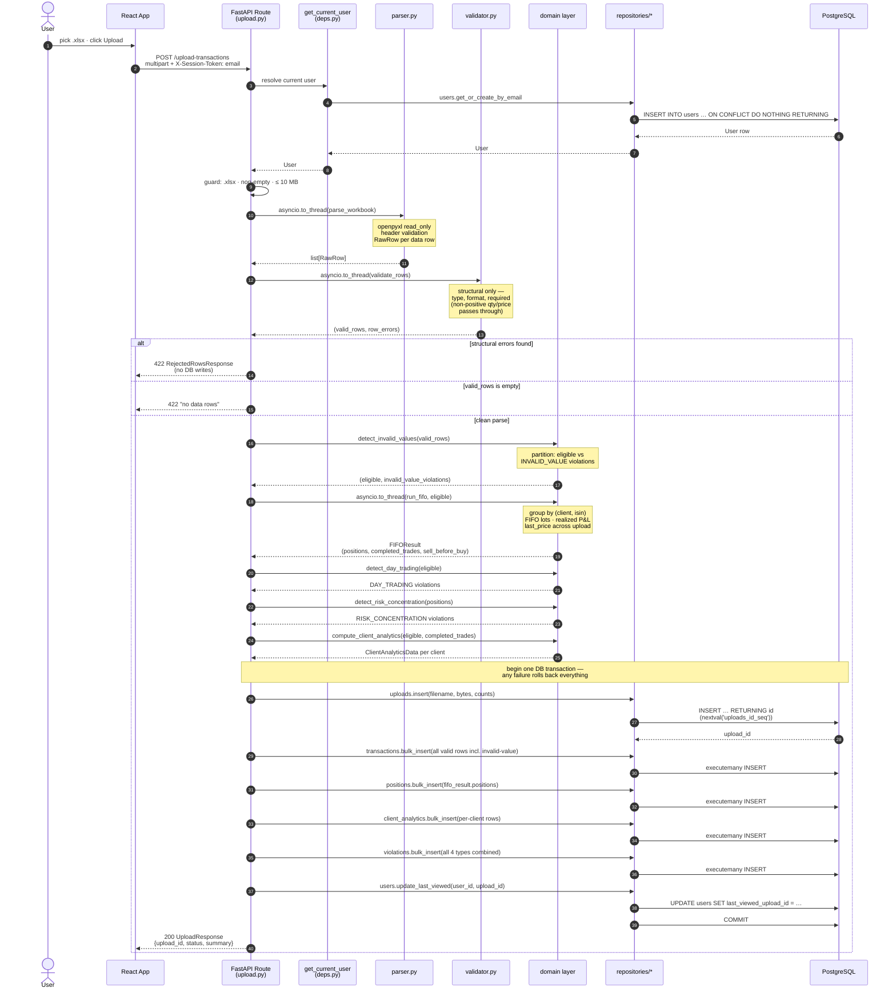
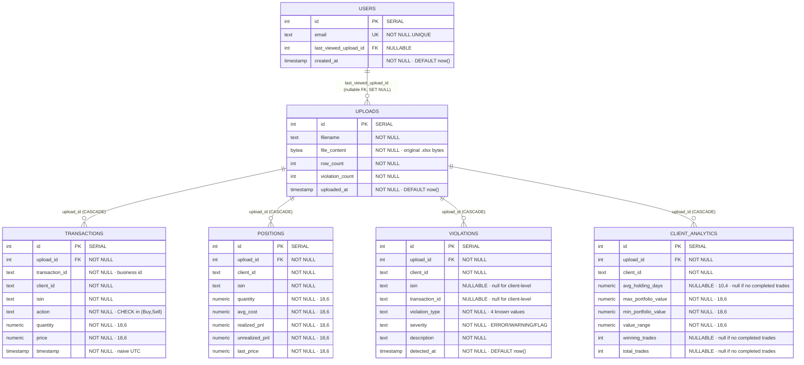
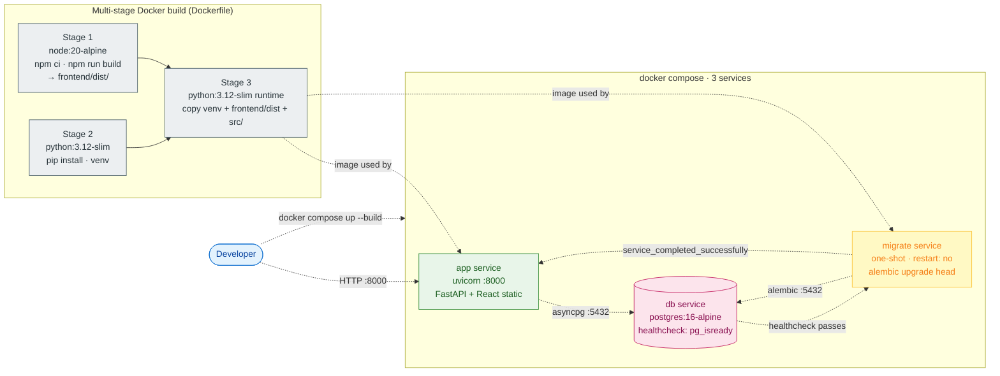

# Architecture

Four diagrams describing the system as built. Every node and edge maps
directly to a file in the repository — nothing here is aspirational.

## Contents

1. [Component graph](#1-component-graph) — every module and how it depends on the others
2. [Upload pipeline sequence](#2-upload-pipeline-sequence) — the request-time flow through every layer
3. [Database schema](#3-database-schema) — tables, columns, foreign keys
4. [Runtime topology](#4-runtime-topology) — Docker stack and startup gating

---

## 1. Component graph

Layered architecture (`api → domain → db`). The `domain/` layer has zero
imports from `api/` or `db/`; this is the property that lets the FIFO
engine be unit-tested without a database or HTTP client.

```mermaid
flowchart TB
    classDef browser fill:#e3f2fd,stroke:#1976d2,color:#0d47a1
    classDef frontend fill:#fff3e0,stroke:#f57c00,color:#e65100
    classDef api fill:#e8f5e9,stroke:#388e3c,color:#1b5e20
    classDef ingestion fill:#fff9c4,stroke:#fbc02d,color:#f57f17
    classDef domain fill:#f3e5f5,stroke:#7b1fa2,color:#4a148c
    classDef db fill:#e0f2f1,stroke:#00796b,color:#004d40
    classDef core fill:#eceff1,stroke:#455a64,color:#263238
    classDef external fill:#fce4ec,stroke:#c2185b,color:#880e4f

    Browser([User's Browser]):::browser
    PG[(PostgreSQL 16<br/>asyncpg driver)]:::external

    subgraph FE["Frontend — React 18 + Vite + Ant Design 5 · built once, served as static files"]
        direction TB
        Main[main.tsx<br/>ReactDOM root]:::frontend
        App[App.tsx<br/>top-level layout · shared clients state · refreshKey · theme]:::frontend
        EmailGate[EmailGate.tsx]:::frontend
        UploadSection[UploadSection.tsx<br/>Ant Upload.Dragger]:::frontend
        UploadHistory[UploadHistory.tsx]:::frontend
        ClientSelector[ClientSelector.tsx<br/>presentational]:::frontend
        PositionsTable[PositionsTable.tsx]:::frontend
        ViolationsTable[ViolationsTable.tsx<br/>filters: type + client]:::frontend
        AnalyticsPanel[AnalyticsPanel.tsx<br/>4-section grid + bonus]:::frontend
        APIClient[api/client.ts<br/>fetch wrapper · injects X-Session-Token]:::frontend
        Types[types.ts<br/>response type defs]:::frontend
    end

    subgraph APIL["API Layer — src/api"]
        direction TB
        AppPy[app.py<br/>create_app · lifespan · CORS · static mount]:::api
        Deps[deps.py<br/>get_current_user · SessionDep · CurrentUserDep]:::api
        Schemas[schemas.py<br/>request + response Pydantic models]:::api
        UploadRoute[routes/upload.py<br/>POST /upload-transactions]:::api
        UploadsRoute[routes/uploads.py<br/>GET /uploads · PUT /users/me/last-viewed]:::api
        ClientsRoute[routes/clients.py<br/>GET /clients · GET /clients/:id/positions]:::api
        ViolationsRoute[routes/violations.py<br/>GET /violations]:::api
        AnalyticsRoute[routes/analytics.py<br/>GET /analytics]:::api
    end

    subgraph INGL["Ingestion — src/ingestion"]
        direction TB
        Parser[parser.py<br/>openpyxl read_only streaming<br/>header validation · row builder]:::ingestion
        Validator[validator.py<br/>structural validation only<br/>type · format · required-field]:::ingestion
    end

    subgraph DOML["Domain — src/domain · pure logic, no infra imports"]
        direction TB
        DomModels[models.py<br/>RawRow · ValidatedRow · Position<br/>ViolationRecord · CompletedTrade<br/>FIFOResult · ClientAnalyticsData<br/>+ severity & action constants]:::domain
        FIFO[fifo.py<br/>run_fifo · _PairFIFO · _compute_last_prices<br/>emits SELL_BEFORE_BUY]:::domain
        Violations[violations.py<br/>detect_invalid_values · detect_day_trading<br/>detect_risk_concentration]:::domain
        AnalyticsDom[analytics.py<br/>compute_client_analytics<br/>portfolio extremes · holding-days · win-rate]:::domain
    end

    subgraph DBL["Data Access — src/db"]
        direction TB
        ORM[models.py<br/>Upload · User · Transaction<br/>Position · Violation · ClientAnalytic<br/>SQLAlchemy 2.0 Mapped declarative]:::db
        RepUploads[repositories/uploads.py]:::db
        RepUsers[repositories/users.py<br/>get_or_create_by_email<br/>INSERT … ON CONFLICT DO NOTHING]:::db
        RepTransactions[repositories/transactions.py]:::db
        RepPositions[repositories/positions.py]:::db
        RepViolations[repositories/violations.py<br/>filters: type · client]:::db
        RepClientAnalytics[repositories/client_analytics.py]:::db
        RepAnalytics[repositories/analytics.py<br/>cross-table aggregates for /analytics]:::db
    end

    subgraph COREL["Cross-Cutting — src/core"]
        direction TB
        Config[config.py<br/>pydantic-settings · SecretStr password<br/>reads .env / env vars]:::core
        Database[database.py<br/>async_sessionmaker · get_session<br/>init_db · close_db lifespan hooks]:::core
    end

    Migrations[migrations/versions/<br/>0001_initial_schema.py<br/>Alembic offline-capable]:::core

    Browser -.HTTPS.-> Main
    Main --> App
    App --> EmailGate
    App --> UploadSection
    App --> UploadHistory
    App --> ClientSelector
    App --> PositionsTable
    App --> ViolationsTable
    App --> AnalyticsPanel
    EmailGate --> APIClient
    UploadSection --> APIClient
    UploadHistory --> APIClient
    PositionsTable --> APIClient
    ViolationsTable --> APIClient
    AnalyticsPanel --> APIClient
    App --> APIClient
    ClientSelector -.props only.-> Types
    ViolationsTable --> Types
    APIClient --> Types

    APIClient -.X-Session-Token: email.-> AppPy

    AppPy --> UploadRoute
    AppPy --> UploadsRoute
    AppPy --> ClientsRoute
    AppPy --> ViolationsRoute
    AppPy --> AnalyticsRoute

    UploadRoute --> Deps
    UploadsRoute --> Deps
    ClientsRoute --> Deps
    ViolationsRoute --> Deps
    AnalyticsRoute --> Deps

    UploadRoute --> Schemas
    UploadsRoute --> Schemas
    ClientsRoute --> Schemas
    ViolationsRoute --> Schemas
    AnalyticsRoute --> Schemas

    UploadRoute --> Parser
    UploadRoute --> Validator
    UploadRoute --> FIFO
    UploadRoute --> Violations
    UploadRoute --> AnalyticsDom

    Parser --> DomModels
    Validator --> DomModels
    FIFO --> DomModels
    Violations --> DomModels
    AnalyticsDom --> DomModels

    UploadRoute --> RepUploads
    UploadRoute --> RepTransactions
    UploadRoute --> RepPositions
    UploadRoute --> RepViolations
    UploadRoute --> RepClientAnalytics
    UploadRoute --> RepUsers
    UploadsRoute --> RepUploads
    UploadsRoute --> RepUsers
    UploadsRoute --> RepPositions
    ClientsRoute --> RepAnalytics
    ClientsRoute --> RepPositions
    ViolationsRoute --> RepViolations
    AnalyticsRoute --> RepAnalytics
    Deps --> RepUsers

    RepUploads --> ORM
    RepUsers --> ORM
    RepTransactions --> ORM
    RepPositions --> ORM
    RepViolations --> ORM
    RepClientAnalytics --> ORM
    RepAnalytics --> ORM

    Deps --> Database
    RepUploads --> Database
    RepUsers --> Database
    RepTransactions --> Database
    RepPositions --> Database
    RepViolations --> Database
    RepClientAnalytics --> Database
    RepAnalytics --> Database

    Database --> Config
    Database -.SQLAlchemy 2.0 + asyncpg.-> PG
    ORM -.declarative mapping.-> PG
    Migrations -.alembic upgrade head.-> PG
```

### Reading the graph

- **Frontend block** — every component is a leaf consumer of `App.tsx`'s
  shared state. Only `App.tsx` and the components that *originate*
  side-effects call `APIClient`; `ClientSelector` is intentionally
  presentational (state hoisted in PR-6 readability pass to eliminate
  duplicate `/clients` fetches).
- **API block** — every route depends on `Deps` (for auth + session)
  and `Schemas` (for I/O shapes). Only `UploadRoute` touches the
  ingestion + domain layers; the GET routes orchestrate repositories
  directly.
- **Domain block** — every detector and the FIFO engine import from
  `DomModels` only. Zero edges leave this block downward toward `db/`
  or sideways into `api/`. That's the testability property.
- **DB block** — every repository depends on `ORM` (for the mapped
  classes) and `Database` (for the session); there are no
  cross-repository imports.

---

## 2. Upload pipeline sequence

The hottest path in the system — `POST /api/v1/upload-transactions` —
end to end. CPU-bound steps are offloaded with `asyncio.to_thread` so
GET requests on other endpoints stay responsive.



### Notes on the sequence

- **Step 4 (`ON CONFLICT DO NOTHING`)** is what makes first-sight user
  creation race-safe under concurrent requests with the same brand-new
  email.
- **Step 12** is the post-submission fix: rows with `quantity < 0` or
  `price < 0` partition out here as `INVALID_VALUE` violations rather
  than rejecting the file. The original row still goes into
  `transactions` for audit (step 21); FIFO and analytics see only the
  `eligible` subset.
- **Steps 20–26** all run inside one DB transaction. The
  `AsyncSession` dependency rolls back automatically on any raise.
- **`last_price`** for each ISIN (used in step 14) is computed *across
  the whole upload*, not per client — so a client holding AAPL is
  marked-to-market at whoever's most recent AAPL trade in the same file
  (`domain/fifo.py:_compute_last_prices`).

---

## 3. Database schema

All 6 tables, every FK, every nullable column. `upload_id` is the
partition key across the four result tables — switching the active
upload (`PUT /users/me/last-viewed`) is purely a flag on `users`, not
a re-run of the pipeline (ADR 014).



### Indexes (from `migrations/versions/0001_initial_schema.py`)

| Table | Index | Purpose |
|---|---|---|
| `transactions` | `(upload_id)` | upload-scoped scans |
| `transactions` | `(upload_id, client_id, isin, timestamp)` | FIFO group fetch |
| `positions` | `(upload_id)` | listing |
| `positions` | UNIQUE `(upload_id, client_id, isin)` | one position per pair |
| `violations` | `(upload_id, client_id)` | filtered listing |
| `violations` | `(upload_id, violation_type)` | type-filtered listing |
| `client_analytics` | UNIQUE `(upload_id, client_id)` | one analytic row per pair |

---

## 4. Runtime topology

`docker compose up --build` brings three services up in dependency
order. Migrations are a separate one-shot service gated behind the
database healthcheck — the app can never boot against an unmigrated
schema.



### Startup gate

1. `db` starts and waits for `pg_isready` to pass on its healthcheck.
2. `migrate` starts only after `db` is healthy. It runs
   `alembic upgrade head` against the live database and exits 0
   (`restart: "no"` so it doesn't loop).
3. `app` starts only after `migrate` exits successfully
   (`service_completed_successfully` condition). The FastAPI process
   binds `:8000` and serves both the API (`/api/v1/*`) and the React
   static bundle (everything else).

### Why a separate `migrate` service

- The app image is stateless — no migration logic embedded in the
  container entrypoint.
- The same `migrate` service can be run ad-hoc with
  `docker compose run --rm migrate alembic revision --autogenerate -m "…"`
  to generate new migrations against the running DB.
- Failures in migration surface as a non-zero exit on `migrate`, which
  prevents `app` from booting — a broken schema cannot serve traffic.

---

## File-to-diagram cross-reference

| Diagram node | Source path |
|---|---|
| `App.tsx` | `frontend/src/App.tsx` |
| `api/client.ts` | `frontend/src/api/client.ts` |
| `app.py` | `src/api/app.py` |
| `deps.py` | `src/api/deps.py` |
| `schemas.py` | `src/api/schemas.py` |
| `routes/upload.py` | `src/api/routes/upload.py` |
| `parser.py` | `src/ingestion/parser.py` |
| `validator.py` | `src/ingestion/validator.py` |
| `fifo.py` | `src/domain/fifo.py` |
| `violations.py` | `src/domain/violations.py` |
| `analytics.py` (domain) | `src/domain/analytics.py` |
| `models.py` (domain) | `src/domain/models.py` |
| `models.py` (db) | `src/db/models.py` |
| `repositories/*` | `src/db/repositories/` |
| `config.py` | `src/core/config.py` |
| `database.py` | `src/core/database.py` |
| `0001_initial_schema.py` | `migrations/versions/0001_initial_schema.py` |
| Docker stages 1–3 | `Dockerfile` |
| `db` / `migrate` / `app` services | `docker-compose.yml` |
